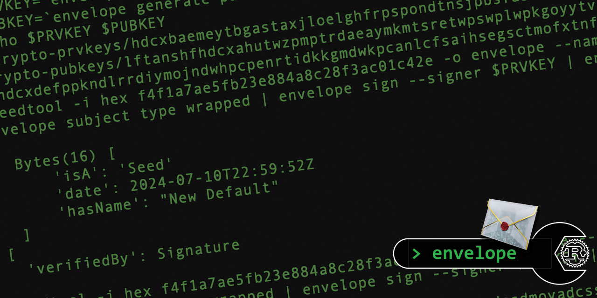

# `envelope`

## A command line tool for manipulating the Gordian Envelope data type, written in pure Rust.

<!--Guidelines: https://github.com/BlockchainCommons/secure-template/wiki -->

### _by Wolf McNally & Christopher Allen_

**NOTE:** Preview version. Not ready for production use.



## Installation

### From crates.io (Recommended)

To install the latest stable version from crates.io, run:

```bash
cargo install bc-envelope-cli
```

To install a specific version:

```bash
cargo install bc-envelope-cli --version 0.15.0
```

### From Source

When building from source, we **strongly recommend** building from a tagged release rather than the tip of the main branch, which may contain unstable code or breaking changes:

```bash
# Clone the repository
git clone https://github.com/BlockchainCommons/bc-envelope-cli-rust.git
cd bc-envelope-cli-rust

# List available tags
git tag -l

# Checkout the most recent tag
git checkout $(git describe --tags --abbrev=0)

# Install the tool
cargo install --path .
```

If you must build from the main branch, be aware that it may have dependency mismatches or other issues:

```bash
# Build without installing (debug build)
cargo build

# Test before installing
cargo test

# If all tests pass, you can install
cargo install --path .
```

Make sure your `~/.cargo/bin` directory is in your `PATH`.

### Troubleshooting Build Issues

If you encounter build problems:

1. **Try debug build first**: `cargo build` instead of `cargo build --release`
2. **Check dependency versions**: The main branch might require specific versions of dependencies
3. **Verify compatible Rust version**: Run `rustc --version` to check your Rust version
4. **Build from a release tag**: Tagged releases have been tested and should build properly

For serious build issues, please open an issue on the GitHub repository with details about your environment and the errors you're seeing.

## Usage

```bash
envelope --help
```

See the [docs](docs/README.md) directory for more information.

**NOTE:** The `envelope` tool does *not* have the same command line syntax as the Swift `envelope` tool.

## Version History

### 0.13.1: May 9, 2025

- Fixed bug that would cause a crash when finding assertions that have their own assertions.

### 0.13.0: April 28, 2025

- Maintenance release.

### 0.12.0: February 4, 2025

- Maintenance release.

### 0.11.0: December 24, 2024

- Added support for [XID Document Services](docs/XID.md).
- Endpoints in XID keys are now deprecated in favor of services.

### 0.10.0: December 15 2024

- Started adding support for [XID Documents](docs/XID.md).
- Anywhere in `envelope` that accepts a `ur:envelope` can also accept any other UR types containing envelopes, including XID documents.

### 0.9.3: December 1, 2024

- Aligned to dependencies.

### 0.9.2: October 16, 2024

- Schnorr signatures are now BIP-340 compliant.

### 0.9.1: July 12, 2024

- Fixed bug that would cause certain valid combinations of SSKR shares to be rejected.
