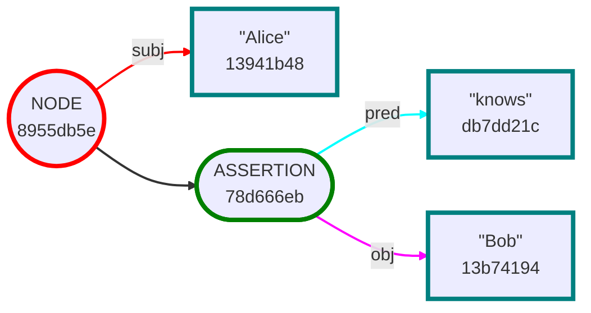

# `envelope` - Overview of the Commands

## Table of Contents

- [`envelope` - Overview of the Commands](#envelope---overview-of-the-commands)
  - [Table of Contents](#table-of-contents)
  - [Help](#help)
  - [Format](#format)
    - [Hex CBOR Output](#hex-cbor-output)
    - [CBOR Diagnostic Notation Output](#cbor-diagnostic-notation-output)
    - [Tree Output](#tree-output)
  - [Mermaid Output](#mermaid-output)
  - [Subject](#subject)
  - [Extract](#extract)
  - [Assertion](#assertion)
  - [Digest](#digest)
  - [Elision](#elision)
  - [Symmetric Key Encryption](#symmetric-key-encryption)
  - [Signatures](#signatures)
  - [SSKR](#sskr)
  - [Salt](#salt)
  - [Compression](#compression)
  - [Walking Envelope Nodes](#walking-envelope-nodes)

## Help

Help is available for the tool and its subcommands.

```
envelope --help

│ A tool for manipulating the Gordian Envelope data type
│
│ Usage: envelope <COMMAND>
│
│ Commands:
│   assertion   Work with the envelope's assertions
│   attachment  Work with the envelope's attachments
│   compress    Compress the envelope or its subject
│   decrypt     Decrypt the envelope's subject
│   digest      Print the envelope's digest
│   elide       Elide a subset of elements
│   encrypt     Encrypt the envelope's subject
│   export      Import the given object to UR form
│   extract     Extract the subject of the input envelope
│   format      Print the envelope in textual format
│   generate    Utilities to generate and convert various objects
│   import      Import the given object to UR form
│   info        Provide type and other information about the object
│   match       Match the envelope subject against a pattern
│   proof       Work with inclusion proofs
│   salt        Add random salt to the envelope
│   sign        Sign the envelope subject with the provided signer(s)
│   sskr        Sharded Secret Key Reconstruction (SSKR)
│   subject     Create an envelope with the given subject
│   decompress  Decompress the envelope or its subject
│   verify      Verify a signature on the envelope using the provided verifiers
│   walk        Walk an envelope's nodes
│   xid         Work with Extensible Identifiers (XID)
│   help        Print this message or the help of the given subcommand(s)
│
│ Options:
│   -h, --help     Print help
│   -V, --version  Print version
```

Here is an example envelope we'll use in many of the examples below. The `envelope` tool expects input and produces output for a number of types it uses in UR format.

```
ALICE_KNOWS_BOB=ur:envelope/lftpsoihfpjziniaihoytpsoihjejtjlktjktpsoiafwjlidutgmnnns
```

## Format

**NOTE:** Unlike the Swift `envelope` tool, the Rust-based tool has no default commands. The downside of this is that some common commands are necessarily more verbose. The upside is that the meaning of commands is more explicit.

Without any options, the `format` command takes an envelope in UR format prints out its formatted contents in envelope notation:

```
envelope format $ALICE_KNOWS_BOB

│ "Alice" [
│     "knows": "Bob"
│ ]
```

### Hex CBOR Output

The `format` command has several output format options specified using `--type`. For example, you can output the hexadecimal of the raw CBOR for the envelope:

```
envelope format --type cbor $ALICE_KNOWS_BOB

│ d8c882d8c965416c696365a1d8c9656b6e6f7773d8c963426f62
```

### CBOR Diagnostic Notation Output

Or your can output the annotated CBOR diagnostic annotation of the envelope:

```
envelope format --type diag $ALICE_KNOWS_BOB

│ 200(
│     [
│         201("Alice"),
│         {
│             201("knows"):
│             201("Bob")
│         }
│     ]
│ )
```

### Tree Output

The envelope tree notation shows the structure of the envelope as a tree, including each element's digest:

```
envelope format --type tree $ALICE_KNOWS_BOB

│ 8955db5e NODE
│     13941b48 subj "Alice"
│     78d666eb ASSERTION
│         db7dd21c pred "knows"
│         13b74194 obj "Bob"
```

Note that internally, envelope uses 256-bit SHA-256 digests, but by default the tree format only shows the first 32 bits of the digest.

If you want to see the full digest in hexadecimal, you can use the `--digest-format full` option:

```
envelope format --type tree --digest-format full $ALICE_KNOWS_BOB

│ 8955db5e016affb133df56c11fe6c5c82fa3036263d651286d134c7e56c0e9f2 NODE
│     13941b487c1ddebce827b6ec3f46d982938acdc7e3b6a140db36062d9519dd2f subj "Alice"
│     78d666eb8f4c0977a0425ab6aa21ea16934a6bc97c6f0c3abaefac951c1714a2 ASSERTION
│         db7dd21c5169b4848d2a1bcb0a651c9617cdd90bae29156baaefbb2a8abef5ba pred "knows"
│         13b741949c37b8e09cc3daa3194c58e4fd6b2f14d4b1d0f035a46d6d5a1d3f11 obj "Bob"
```

Alternatively, you can display the full digests as URs, which is useful for identifying elements you want to elide or encrypt:

```
envelope format --type tree --digest-format ur $ALICE_KNOWS_BOB

│ ur:digest/hdcxldgouyhyadimzmpaeourhfsectvaskspdlotaxidiatbgydejnbwgskbhfrtwlwzneroatds NODE
│     ur:digest/hdcxbwmwcwfdkecauerfvsdirpwpfhfgtalfmulesnstvlrpoyfzuyenamdpmdcfutdlstyaqzrk subj "Alice"
│     ur:digest/hdcxkstbiywmmygsasktnbfwhtrppkclwdcmmugejesokejlbnftrdwspsmdcechbboerhzebtws ASSERTION
│         ur:digest/hdcxuykitdcegyinqzlrlgdrcwsbbkihcemtchsntabdpldtbzjepkwsrkdrlernykrddpjtgdfh pred "knows"
│         ur:digest/hdcxbwrlfpmwnsemrovtnssrtnotcfgshdvezcjedlbbtypatiwtecoxjnjnhtcafhbysptsnsnl obj "Bob"
```

Here we copy the digest of the assertion to a variable so we can use it for elision:

```
KNOWS_BOB_ASSERTION=ur:digest/hdcxkstbiywmmygsasktnbfwhtrppkclwdcmmugejesokejlbnftrdwspsmdcechbboerhzebtws
envelope elide removing $KNOWS_BOB_ASSERTION $ALICE_KNOWS_BOB | envelope format --type tree --digest-format ur

│ ur:digest/hdcxldgouyhyadimzmpaeourhfsectvaskspdlotaxidiatbgydejnbwgskbhfrtwlwzneroatds NODE
│     ur:digest/hdcxbwmwcwfdkecauerfvsdirpwpfhfgtalfmulesnstvlrpoyfzuyenamdpmdcfutdlstyaqzrk subj "Alice"
│     ur:digest/hdcxkstbiywmmygsasktnbfwhtrppkclwdcmmugejesokejlbnftrdwspsmdcechbboerhzebtws ELIDED
```

With the `--hide-nodes` option, the structure of the envelope is shown without digests and without the `NODE` element. This is useful for understanding the semantic structure of the envelope:

```
envelope format --type tree --hide-nodes $ALICE_KNOWS_BOB

│ "Alice"
│     ASSERTION
│         "knows"
│         "Bob"
```

## Mermaid Output

The `format` command can also produce a Mermaid diagram of the envelope structure. This is useful for visualizing the relationships between elements in the envelope:

```
envelope format --type mermaid $ALICE_KNOWS_BOB

│ %%{ init: { 'theme': 'default', 'flowchart': { 'curve': 'basis' } } }%%
│ graph LR
│ 0(("NODE<br>8955db5e"))
│     0 -- subj --> 1["&quot;Alice&quot;<br>13941b48"]
│     0 --> 2(["ASSERTION<br>78d666eb"])
│         2 -- pred --> 3["&quot;knows&quot;<br>db7dd21c"]
│         2 -- obj --> 4["&quot;Bob&quot;<br>13b74194"]
│ style 0 stroke:red,stroke-width:4px
│ style 1 stroke:teal,stroke-width:4px
│ style 2 stroke:green,stroke-width:4px
│ style 3 stroke:teal,stroke-width:4px
│ style 4 stroke:teal,stroke-width:4px
│ linkStyle 0 stroke:red,stroke-width:2px
│ linkStyle 1 stroke-width:2px
│ linkStyle 2 stroke:cyan,stroke-width:2px
│ linkStyle 3 stroke:magenta,stroke-width:2px
```

When passed to a Mermaid renderer, this will produce a diagram that looks like this:



Mermaid output has several options, including the `--theme` option to specify the color theme of the diagram. For example, to use a dark theme, you can run:

```
envelope format --type mermaid --theme dark $ALICE_KNOWS_BOB

│ %%{ init: { 'theme': 'dark', 'flowchart': { 'curve': 'basis' } } }%%
│ graph LR
│ 0(("NODE<br>8955db5e"))
│     0 -- subj --> 1["&quot;Alice&quot;<br>13941b48"]
│     0 --> 2(["ASSERTION<br>78d666eb"])
│         2 -- pred --> 3["&quot;knows&quot;<br>db7dd21c"]
│         2 -- obj --> 4["&quot;Bob&quot;<br>13b74194"]
│ style 0 stroke:red,stroke-width:4px
│ style 1 stroke:teal,stroke-width:4px
│ style 2 stroke:green,stroke-width:4px
│ style 3 stroke:teal,stroke-width:4px
│ style 4 stroke:teal,stroke-width:4px
│ linkStyle 0 stroke:red,stroke-width:2px
│ linkStyle 1 stroke-width:2px
│ linkStyle 2 stroke:cyan,stroke-width:2px
│ linkStyle 3 stroke:magenta,stroke-width:2px
```

You can also specify the orientation of the diagram using the `--orientation` option. For example, to display the diagram from top to bottom, you can run:

```
envelope format --type mermaid --theme dark --orientation top-to-bottom $ALICE_KNOWS_BOB

│ %%{ init: { 'theme': 'dark', 'flowchart': { 'curve': 'basis' } } }%%
│ graph TB
│ 0(("NODE<br>8955db5e"))
│     0 -- subj --> 1["&quot;Alice&quot;<br>13941b48"]
│     0 --> 2(["ASSERTION<br>78d666eb"])
│         2 -- pred --> 3["&quot;knows&quot;<br>db7dd21c"]
│         2 -- obj --> 4["&quot;Bob&quot;<br>13b74194"]
│ style 0 stroke:red,stroke-width:4px
│ style 1 stroke:teal,stroke-width:4px
│ style 2 stroke:green,stroke-width:4px
│ style 3 stroke:teal,stroke-width:4px
│ style 4 stroke:teal,stroke-width:4px
│ linkStyle 0 stroke:red,stroke-width:2px
│ linkStyle 1 stroke-width:2px
│ linkStyle 2 stroke:cyan,stroke-width:2px
│ linkStyle 3 stroke:magenta,stroke-width:2px
```

Like tree output, the Mermaid output can also be configured to hide the `NODE` element and its digests using the `--hide-nodes` option. We'll also demonstrate the `--monochrome` option, which produces a diagram with a single color for all elements. You can combine `--monochrone` and `--theme`.

```
envelope format --type mermaid --monochrome --theme forest --hide-nodes $ALICE_KNOWS_BOB

│ %%{ init: { 'theme': 'forest', 'flowchart': { 'curve': 'basis' } } }%%
│ graph LR
│ 0["&quot;Alice&quot;"]
│     0 --> 1(["ASSERTION"])
│         1 -- pred --> 2["&quot;knows&quot;"]
│         1 -- obj --> 3["&quot;Bob&quot;"]
│ style 0 stroke-width:4px
│ style 1 stroke-width:4px
│ style 2 stroke-width:4px
│ style 3 stroke-width:4px
│ linkStyle 0 stroke-width:2px
│ linkStyle 1 stroke-width:2px
│ linkStyle 2 stroke-width:2px
```

## Subject

The `subject type` subcommand creates a new envelope with a subject of the given type. You specify the data type of the subject, then the subject value itself.

```
envelope subject type string "Hello."

│ ur:envelope/tpsoiyfdihjzjzjldmksbaoede
```

When we feed this envelope back into the `format` comand, we get the envelope printed in envelope notation. This is why `"Hello."` is printed with quotes around it:

```
envelope format ur:envelope/tpsoiyfdihjzjzjldmksbaoede

│ "Hello."
```

Using the help command, you can see a listing of all the types supported:

```
envelope subject type --help

│ ...
│ Possible values:
│ - arid:     ARID: Apparently Random Identifier (ur:arid)
│ - bool:     Boolean (`true` or `false`)
│ - cbor:     CBOR data in hex
│ - data:     Binary byte string in hex
│ - date:     Date (ISO 8601)
│ - digest:   Cryptographic digest (ur:digest)
│ - envelope: Envelope (ur:envelope)
│ - known:    Known Value (number or string)
│ - number:   Numeric value,
│ - string:   UTF-8 String
│ - ur:       Uniform Resource (UR)
│ - uri:      URI
│ - uuid:     UUID
│ - wrapped:  Wrapped Envelope (ur:envelope)
│ ...
```

## Extract

To extract the actual data of the envelope's subject, use the `extract` command:

```
envelope extract string ur:envelope/tpsoiyfdihjzjzjldmksbaoede

│ Hello.
```

In an envelope with assertions, the `extract` command just returns the subject without the assertions:

```
envelope extract string $ALICE_KNOWS_BOB

│ Alice
```

If you want the subject returned as an envelope, use the `envelope` data type:

```
envelope extract envelope $ALICE_KNOWS_BOB

│ ur:envelope/tpsoihfpjziniaihmebdmodl
```

```
envelope format ur:envelope/tpsoihfpjziniaihmebdmodl

│ "Alice"
```

## Assertion

To add an assertion to an existing envelope, use the `assertion` command. In this example, `envelope` is invoked twice, once to create the envelope with its subject, and the second to add an assertion to it:

```
envelope subject type string "Alice" | envelope assertion add pred-obj string "knows" string "Bob"

│ ur:envelope/lftpsoihfpjziniaihoytpsoihjejtjlktjktpsoiafwjlidutgmnnns
```

Note that we have just constructed the `$ALICE_KNOWS_BOB` example envelope from scratch!

The `assertion` command has several subcommands that help us work with assertions:

```
envelope help assertion

│ Work with the envelope's assertions
│
│ Usage: envelope assertion <COMMAND>
│
│ Commands:
│   add     Add an assertion to the given envelope
│   all     Retrieve all the envelope's assertions
│   at      Retrieve the assertion at the given index
│   count   Print the count of the envelope's assertions
│   create  Create a bare assertion with the given predicate and object
│   find    Find all assertions matching the given criteria
│   remove  Remove an assertion from the given envelope
│   help    Print this message or the help of the given subcommand(s)
│
│ Options:
│   -h, --help     Print help
│   -V, --version  Print version
```

## Digest

Every envelope produces a unique `Digest`, and since every part of an envelope is *itself* an envelope, every part also has its own unique Digest.

This prints the digest of the envelope as a whole:

```
envelope digest $ALICE_KNOWS_BOB

│ ur:digest/hdcxldgouyhyadimzmpaeourhfsectvaskspdlotaxidiatbgydejnbwgskbhfrtwlwzneroatds
```

While this prints the digest of the *subject* of the envelope:

```
envelope extract envelope $ALICE_KNOWS_BOB | envelope digest

│ ur:digest/hdcxbwmwcwfdkecauerfvsdirpwpfhfgtalfmulesnstvlrpoyfzuyenamdpmdcfutdlstyaqzrk
```

Note that the two digests above are different.

Let's print the digest of the example envelope's assertion:

```
envelope assertion at 0 $ALICE_KNOWS_BOB | envelope digest

│ ur:digest/hdcxkstbiywmmygsasktnbfwhtrppkclwdcmmugejesokejlbnftrdwspsmdcechbboerhzebtws
```

Finally, let's print the digest of the object of the envelope's assertion:

```
envelope assertion at 0 $ALICE_KNOWS_BOB |    # Gets the assertion
    envelope extract object |                 # Gets the object of the assertion
    envelope digest                           # Prints the digest

│ ur:digest/hdcxbwrlfpmwnsemrovtnssrtnotcfgshdvezcjedlbbtypatiwtecoxjnjnhtcafhbysptsnsnl
```

## Elision

Now that we can use digests to specify the parts of an envelope, we can transform it in interesting ways. Elision means to remove various parts of an envelope without changing its digest. The `elide` command and its two subcommands `removing` and `revealing` (the default) provide this service.

Let's start by getting the digest of the subject of our example envelope:

```
SUBJECT_DIGEST=`envelope extract envelope $ALICE_KNOWS_BOB | envelope digest`
echo $SUBJECT_DIGEST

│ ur:digest/hdcxbwmwcwfdkecauerfvsdirpwpfhfgtalfmulesnstvlrpoyfzuyenamdpmdcfutdlstyaqzrk
```

Now if we want to produce a version of the envelope with its subject elided, we provide that digest to the `elide removing` command. Here we do the elision then immediately pipe the resulting envelope to the `format` command:

```
envelope elide removing $SUBJECT_DIGEST $ALICE_KNOWS_BOB | envelope format

│ ELIDED [
│     "knows": "Bob"
│ ]
```

We can provide any number of digests in the "target set" of the `elide` command. If the `elide removing` command is used, then *only* the elements in the set will be elided. If the `elide revealing` command is used, then all *but* the elements in the set will be elided.

Here we provide two digests: the first for the subject as above, and the digest that represents the object of the assertion we produced previously using the `digest` command:

```
BOB_DIGEST=ur:digest/hdcxbwrlfpmwnsemrovtnssrtnotcfgshdvezcjedlbbtypatiwtecoxjnjnhtcafhbysptsnsnl
envelope elide removing "$SUBJECT_DIGEST $BOB_DIGEST" $ALICE_KNOWS_BOB | envelope format

│ ELIDED [
│     "knows": ELIDED
│ ]
```

Now this is important: the elided version of the envelope we produced has the *same* digest as the original, un-elided envelope. This means that things like cryptographic signatures added to the envelope as assertions, if not themselves elided, will *still verify*.

Let's compare the original envelope's digest to the elided version's digest:

```
envelope digest $ALICE_KNOWS_BOB

│ ur:digest/hdcxldgouyhyadimzmpaeourhfsectvaskspdlotaxidiatbgydejnbwgskbhfrtwlwzneroatds
```

```
envelope elide removing "$SUBJECT_DIGEST $BOB_DIGEST" $ALICE_KNOWS_BOB | envelope digest

│ ur:digest/hdcxldgouyhyadimzmpaeourhfsectvaskspdlotaxidiatbgydejnbwgskbhfrtwlwzneroatds
```

So even though the original and elided versions are in fact *different envelopes*, their digests are *exactly the same!*

## Symmetric Key Encryption

The `envelope` tool provides the `encrypt` and `decrypt` commands to perform symmetric key encryption of an envelope's subject. Why not the *whole* envelope? That's easy too, and we'll get to it shortly, but first we need a key. `envelope` has the `generate key` command that generates a new encryption key.

```
KEY=`envelope generate key`
echo $KEY

│ ur:crypto-key/hdcxwfmnsbasamfgptbkwtvofgctmwroldcxjnltwsatzsdmimhlvehlsphebsfrzcssbzinhnrd
```

Once we have this, we can produce a version of our example envelope that has its subject encrypted:

```
ENCRYPTED=`envelope encrypt --key $KEY $ALICE_KNOWS_BOB`
envelope format $ENCRYPTED

│ ENCRYPTED [
│     "knows": "Bob"
│ ]
```

Note that encryption uses randomness to help hide what has been encrypted. So each time you perform an encryption, the resulting envelope will be different:

```
envelope encrypt --key $KEY $ALICE_KNOWS_BOB

│ ur:envelope/lftansfwlrgepkbnsgostemndaknguidgsmdpkfhtsimkibeotvymynbsggdcknegmfnspbdmhenchnswelslkzcnsbzhddatansfphdcxbwmwcwfdkecauerfvsdirpwpfhfgtalfmulesnstvlrpoyfzuyenamdpmdcfutdloytpsoihjejtjlktjktpsoiafwjlidbnvlrtin
```

```
envelope encrypt --key $KEY $ALICE_KNOWS_BOB

│ ur:envelope/lftansfwlrgectvameeovwntswtdhllagsecvalrsrfgamsovtolnnmopfgdaectsfvazopdbketfgfpckweuochiaolhddatansfphdcxbwmwcwfdkecauerfvsdirpwpfhfgtalfmulesnstvlrpoyfzuyenamdpmdcfutdloytpsoihjejtjlktjktpsoiafwjlidytztdpms
```

But notice! When you encrypt parts of an envelope, its *digest* remains the same as the unencrypted version:

```
envelope digest $ALICE_KNOWS_BOB

│ ur:digest/hdcxldgouyhyadimzmpaeourhfsectvaskspdlotaxidiatbgydejnbwgskbhfrtwlwzneroatds
```

```
envelope encrypt --key $KEY $ALICE_KNOWS_BOB | envelope digest

│ ur:digest/hdcxldgouyhyadimzmpaeourhfsectvaskspdlotaxidiatbgydejnbwgskbhfrtwlwzneroatds
```

If you want the digest to be different each time you encrypt, you can add random salt to the envelope; see below.

So far we've just encrypted the subject of an envelope. But what if we want to encrypt the entire envelope, including its assertions?

For this, you simply wrap the envelope in an outer envelope, and encrypt that!

```
WRAPPED=`envelope subject type wrapped $ALICE_KNOWS_BOB`
envelope format $WRAPPED

│ {
│     "Alice" [
│         "knows": "Bob"
│     ]
│ }
```

The outer envelope has just a subject, which is the entire contents of the inner envelope!

What's the advantage in doing things this way? Once you have a wrapped envelope, you can add additional assertions to it, like signatures, that will still verify even if the subject has been encrypted or elided!

Note that since we created a new envelope by doing the wrapping, that this new envelope will *not* have the same digest as its inner envelope:

```
envelope digest $ALICE_KNOWS_BOB

│ ur:digest/hdcxldgouyhyadimzmpaeourhfsectvaskspdlotaxidiatbgydejnbwgskbhfrtwlwzneroatds
```

```
envelope digest $WRAPPED

│ ur:digest/hdcxzclocydkrespdwwygrldbyvabyplolrdfgfnsolnjkgwledyvwhtghlncylkhgdnltdkjest
```

```
WRAPPED_ENCRYPTED=`envelope encrypt --key $KEY $WRAPPED`
envelope format $WRAPPED_ENCRYPTED

│ ENCRYPTED
```

This encrypted envelope still has the same digest as the wrapped but unencrypted version:

```
envelope digest $WRAPPED

│ ur:digest/hdcxzclocydkrespdwwygrldbyvabyplolrdfgfnsolnjkgwledyvwhtghlncylkhgdnltdkjest
```

```
envelope digest $WRAPPED_ENCRYPTED

│ ur:digest/hdcxzclocydkrespdwwygrldbyvabyplolrdfgfnsolnjkgwledyvwhtghlncylkhgdnltdkjest
```

To recover the original envelope we reverse the steps, first decrypting, then unwrapping:

```
envelope decrypt --key $KEY $WRAPPED_ENCRYPTED |   # Decrypt the envelope
    envelope extract wrapped |                     # Unwrap the inner envelope
    envelope format                                # Show the formatted contents

│ "Alice" [
│     "knows": "Bob"
│ ]
```

## Signatures

Similar to how you can encrypt an envelope's subject, you can also cryptographically sign the subject by adding an assertion. Since signing uses public key cryptography, we first need a set of private and public keys that can be used for signing, verification, encryption, and decryption.

```
envelope generate prvkeys

│ ur:crypto-prvkeys/lftansgohdcxindkbyjtgtjetacylsbbbzlufnrduewpsawfwdleganehtcmdsdaylvdksoebwpstansgehdcxoxbadivdwzjofhdaiememeswdncacmbypfaysrtidphkrfpyqzfwbzhemdiebaktielgzmlf
```

The above generation is random. If you wish to use a `seed` as your starting point:

```
SEED=ur:seed/oyadgdmdeefejoaonnatcycefxjedrfyaspkiakionamgl
PRVKEYS=`envelope generate prvkeys $SEED`
echo $PRVKEYS

│ ur:crypto-prvkeys/lftansgohdcxasfymwaxcpktaowpatotolckatgrhnceveasueskwereprcyfrmstpfgflaahnwltansgehdcxsftngernmnplghvectctjnctwzonotgopfosylmokphdessnzmldgodewphpsedsgewlmthh
```

Of course, we'll also want to distribute the public keys, so the signature can be verified:

```
PUBKEYS=`envelope generate pubkeys $PRVKEYS`
echo $PUBKEYS

│ ur:crypto-pubkeys/lftanshfhdcxweplrnkpsruepkaeahnetppsteaojtdlgudetlyksrlbzoiduoglpemujydnsrattansgrhdcximbgoskbjpgtluwededpjywdlkfwksjpglsrfdcaurdahycfasmtylihpfrsfgkblomttisr
```

Now we can sign our envelope:

```
SIGNED=`envelope sign --signer $PRVKEYS $ALICE_KNOWS_BOB`
```

Let's see what it looks like when formatted now:

```
envelope format $SIGNED

│ "Alice" [
│     "knows": "Bob"
│     'signed': Signature
│ ]
```

OK... there's a signature there now, but it's a new assertion on the subject of the envelope, "Alice". This means that any of the assertions can still be altered without invalidating the signature on the subject. But what if we want to sign the *whole* envelope, including the fact that she knows Bob?

Wrapping to the rescue again!

```
WRAPPED_SIGNED=`envelope subject type wrapped $ALICE_KNOWS_BOB | envelope sign --signer $PRVKEYS`
envelope format $WRAPPED_SIGNED

│ {
│     "Alice" [
│         "knows": "Bob"
│     ]
│ } [
│     'signed': Signature
│ ]
```

Now the entire contents of the envelope are signed, and if we send it to someone who has our public key, they can verify the signature:

```
envelope verify --verifier $PUBKEYS $WRAPPED_SIGNED

│ ur:envelope/lftpsplftpcsihfpjziniaihoytpcsihjejtjlktjktpcsiafwjlidoyaxtpcstansghhdfznltbglechtrkecemfhahkbrkcfzcasfnbbkpktzmsrvewtksknahmnpkinguktdwkgfrdklfrtdwpssamujtidcteovyongeamayftfxiaesfwceecoxueimmhwfrsyaidiycwdl
```

To facilitate piping commands, the `verify` command prints the input envelope if the validation is successful (unless the `--silent` flag is provided), and exits with an error condition if it is unsuccessful. Lets produce some incorrect public keys and try this:

```
BAD_PUBKEYS=`envelope generate prvkeys | envelope generate pubkeys`
envelope verify --verifier $BAD_PUBKEYS $WRAPPED_SIGNED

│ Error: could not verify a signature
```

## SSKR

SSKR lets you split ("shard") an envelope into several shares, a threshold of which is necessary to recover the original message. If we shard our example envelope into 3 shares and assign them to a shell array, we get:

```
SHARE_ENVELOPES=(`envelope sskr split -g 2-of-3 $ALICE_KNOWS_BOB`)
echo $SHARE_ENVELOPES

│ ur:envelope/lftansfwlrhdcehtqzrsmdihaxjsidbemsrhjpvdyltlmyrlctimasaewdpertdyhlidrtgslupfssiyjzmymwrnfhfnkisegdpdjytodeptinntfzismulkiagtstoxplhddatansfphdcxzclocydkrespdwwygrldbyvabyplolrdfgfnsolnjkgwledyvwhtghlncylkhgdnoyamtpsotaadechddajlimaeadaegtptkedabegdzebgjtfnvobddkiopyhllnseeesogudkqdpsfpmefhemrswzeevsjpnnwmto ur:envelope/lftansfwlrhdcehtqzrsmdihaxjsidbemsrhjpvdyltlmyrlctimasaewdpertdyhlidrtgslupfssiyjzmymwrnfhfnkisegdpdjytodeptinntfzismulkiagtstoxplhddatansfphdcxzclocydkrespdwwygrldbyvabyplolrdfgfnsolnjkgwledyvwhtghlncylkhgdnoyamtpsotaadechddajlimaeadadnyvojpkkpktbidtkhyndgdiosbpatndazegwkndrhffzfxcnjegaplhtaxahpmaebdfncsyl ur:envelope/lftansfwlrhdcehtqzrsmdihaxjsidbemsrhjpvdyltlmyrlctimasaewdpertdyhlidrtgslupfssiyjzmymwrnfhfnkisegdpdjytodeptinntfzismulkiagtstoxplhddatansfphdcxzclocydkrespdwwygrldbyvabyplolrdfgfnsolnjkgwledyvwhtghlncylkhgdnoyamtpsotaadechddajlimaeadaoyafhhnntlbflutqdbainnttevytigapmkoswpdbbhkwpfdptbzftamweuoatcacncnlukbpa
```

For brevity, we assign the elements of the array three shell variables: `$SHARE_1`, `SHARE_2`, and `SHARE_3`:

```
SHARE_1=${SHARE_ENVELOPES[1]}
SHARE_2=${SHARE_ENVELOPES[2]}
SHARE_3=${SHARE_ENVELOPES[3]}
```

> **NOTE:** The above arrays assume you are using `zsh` on your Mac, which has been the default shell since 2019. However, if you have a user account that was created before Catalina (2019), and you've never upgraded your shell, then you're still using `bash`. In this case, the arrays will be numbered [0], [1], and [2].

If we format the first of those shares, we see that the subject is a symmetrically encrypted message, and its assertion is an SSKR share, which is one of the shares needed to decrypt the subject.

```
envelope format $SHARE_1

│ ENCRYPTED [
│         'sskrShare': SSKRShare
│ ]
```

Taking the first and third of those shares, we can recover the original envelope:

```
RECOVERED=`envelope sskr join $SHARE_1 $SHARE_3`
envelope format $RECOVERED

│ "Alice" [
│     "knows": "Bob"
│ ]
```

But just one of the shares is insufficient:

```
envelope sskr join $SHARE_2

│ Error: invalid SSKR shares
```

## Salt

Envelopes with the same content produce the same digests, even when elided or encrypted. This can make identical or even similar envelopes *correlatable*.

Here we compare the digests produced by the plaintext and encrypted versions of the same envelope:

```
KEY=`envelope generate key`
WRAPPED=`envelope subject type wrapped $ALICE_KNOWS_BOB`
ENCRYPTED=`envelope encrypt --key $KEY $WRAPPED`
envelope digest $WRAPPED; envelope digest $ENCRYPTED

│ ur:digest/hdcxzclocydkrespdwwygrldbyvabyplolrdfgfnsolnjkgwledyvwhtghlncylkhgdnltdkjest
│ ur:digest/hdcxzclocydkrespdwwygrldbyvabyplolrdfgfnsolnjkgwledyvwhtghlncylkhgdnltdkjest
```

The `salt` command lets us add an assertion with random data. If we do this before encrypting, the unencrypted subject will be the same, but the digest will be different:

```
SALTED_WRAPPED=`envelope salt $ALICE_KNOWS_BOB | envelope subject type wrapped`
envelope format $SALTED_WRAPPED

│ {
│     "Alice" [
│         "knows": "Bob"
│         'salt': Salt
│     ]
│ }
```

```
SALTED_ENCRYPTED=`envelope encrypt --key $KEY $SALTED_WRAPPED`
envelope digest $ENCRYPTED; envelope digest $SALTED_ENCRYPTED

│ ur:digest/hdcxzclocydkrespdwwygrldbyvabyplolrdfgfnsolnjkgwledyvwhtghlncylkhgdnltdkjest
│ ur:digest/hdcxcxzmtedefmfmzoayurlniewzwtcylahndrsozoehcapfoesspfdwglonmownylknldnydncm
```

## Compression

Envelopes can be compressed. Similar to elision and encryption, the digest of an envelope does not change when it is compressed.

Let's define a helper function to output the number of CBOR bytes an envelope contains when encoded:

```
function env_cbor_count { envelope format --type cbor "$1" | wc -c | bc -l <<< "($(cat)) / 2" | xargs printf "%.0f\n" }
```

In this example, we create an envelope with a long text note then print the number of bytes it takes to encode as CBOR and the envelope's digest.

```
NOTE='Lorem ipsum dolor sit amet consectetur adipiscing elit mi nibh ornare proin blandit diam ridiculus, faucibus mus dui eu vehicula nam donec dictumst sed vivamus bibendum aliquet efficitur. Felis imperdiet sodales dictum morbi vivamus augue dis duis aliquet velit ullamcorper porttitor, lobortis dapibus hac purus aliquam natoque iaculis blandit montes nunc pretium.'
ENVELOPE=`envelope subject type string "Alice" | envelope assertion add pred-obj known note string "${NOTE}${NOTE}${NOTE}"`
env_cbor_count $ENVELOPE
envelope digest $ENVELOPE

│ 1110
│ ur:digest/hdcxykfgenetdppftsuyhngwglrdiopsmtgshpteprchcaasvyiasbjldaqzcpfhzmcfcarkjepf
```

Now we compress the envelope, and again print the number of bytes it takes to encode and its digest. Note that although the number of bytes has gone down significantly, the digest remains the same.

```
COMPRESSED=`envelope compress $ENVELOPE`
env_cbor_count $COMPRESSED
envelope digest $COMPRESSED

│ 312
│ ur:digest/hdcxykfgenetdppftsuyhngwglrdiopsmtgshpteprchcaasvyiasbjldaqzcpfhzmcfcarkjepf
```

When an envelope is compressed, you treat it like any other envelope (add assertions to it, use it as the object of an assertion, etc.) but you can't access its contents until it's been decompressed.

```
envelope format $COMPRESSED

│ COMPRESSED
```

When the envelope is decompressed, it returns to its original size.

```
DECOMPRESSED=`envelope decompress $COMPRESSED`
env_cbor_count $DECOMPRESSED
envelope digest $DECOMPRESSED

│ 1110
│ ur:digest/hdcxykfgenetdppftsuyhngwglrdiopsmtgshpteprchcaasvyiasbjldaqzcpfhzmcfcarkjepf
```

The above technique compresses the entire envelope. You can also compress or decompress just the subject of an envelope by adding the `--subject` flag:

```
ALICE_COMPRESSED=`envelope compress --subject $ALICE_KNOWS_BOB`
envelope format $ALICE_COMPRESSED

│ COMPRESSED [
│     "knows": "Bob"
│ ]
```

Note that compression (like encryption) has a fixed storage overhead. So very short envelopes, like the subject of this envelope may actually become longer when compressed.

```
env_cbor_count $ALICE_KNOWS_BOB
env_cbor_count $ALICE_COMPRESSED

│ 26
│ 76
```

Finally, note that compressing an already-compressed envelope, or decompressing an already decompressed envelope, has no effect.

## Walking Envelope Nodes

The `walk` command provides powerful tools for navigating and manipulating envelope nodes based on their obscuration state. It can:

- List all node digests in an envelope
- Find nodes by obscuration type (elided, encrypted, compressed)
- Restore elided nodes from original envelopes
- Decrypt encrypted nodes with symmetric keys
- Decompress compressed nodes

For detailed documentation and examples, see [Walk.md](Walk.md).
